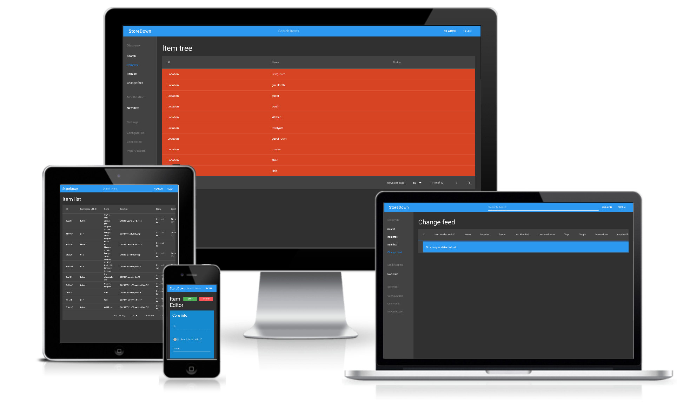

# StoreDown

> Do not store up for yourselves treasures on earth, where moths and vermin destroy, and where thieves break in and steal.

I live by the mantra

> If you cannot find something or cannot put it away, you don't need it.

StoreDown is a Progressive Web App(PWA) designed to help you put stuff away and find it again.
Due to the way StoreDown was built it can also be a forms application fronting CouchDB.(Like a very simple alternative of Microsoft Access)

I personally use StoreDown every day to keep track of 1,359 items  at time of writing. Those items range from: a 90 pack of dental floss picks, a Jig saw, a refrigerator, to red 15W USB A to USB C cable(of which I have 6). If having this capability appeals to you come along and enjoy the fun!

## [Demo/Application](#TODO)
> If you use this you should probably take regular backups exports of your data.

> If you want to sync between multiple devices, you need to setup a CouchDB server.

## Features
- BYOS(Bring Your Own Server)
- Touch friendly and mouse friendly ui
- Search
- Can function offline
- CouchDB Sync via PouchDB
- Responsive
- Tags
- Customizable fields
- Data Export(JSON, YML, and CSV)
- Data Import(JSON, and YML)
- TODO markdown

## Quick Links
- [How to install](./docs/install.md)
- [How to develop](./docs/development.md)
- [Config/Custom field customization](./docs/config.schema.md)
- [How I use StoreDown](./docs/system.md)
- [Sub Reddit](https://www.reddit.com/r/storedown/)

---

## FAQ

> Why not just use a spreadsheet?

The first answer is mobile. Spreadsheets work terrible on mobile.
The second answer is customization. The ability to search via UPC codes is the killer application for this system.

> So you read "Don't store up" and built an inventory system?

Keeping track of what you have and storing up are separate things.
Keeping track of things lets you do cool things like see the last time something was used.
Haven't use the rock band drums in 3 years? Might do good for someone else.
This use case alone is why this system is called `StoreDown`.

Also allows you to not over consume.
Another killer application of this system is just label cables.
- Do I have an unused HDMI cable somewhere?
- I need a USB-A to micro-USB cable thats at least 7 feet long.

Labeling items allows some unforeseen benefits like:
- Sending someone not technical to retrieve a parallel port.
- Answering questions like:
  - When did I buy xyz?
  - It's broken. Is it under warranty?

> I don't like xyz about StoreDown, do you know of any alternatives? 

I would really like to be friends with the folks in orbit around [InvenTree](https://github.com/inventree/InvenTree) and [Grocy](https://github.com/grocy/grocy). 
So go check those out.